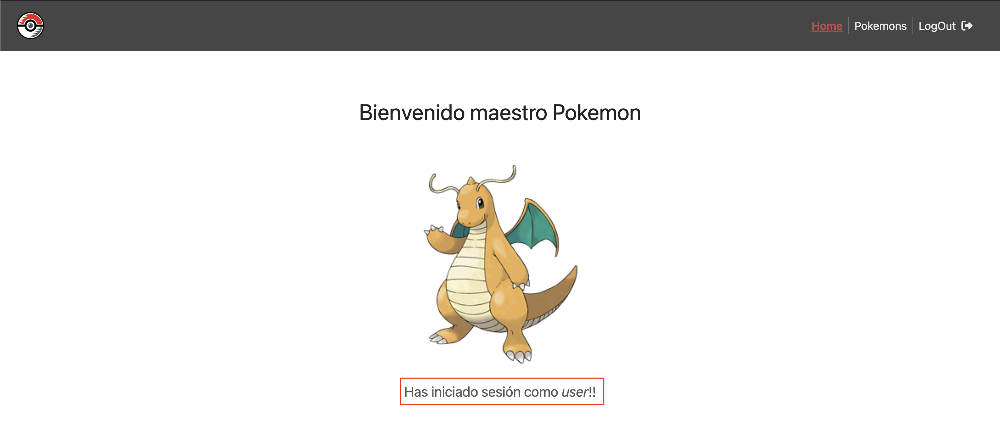
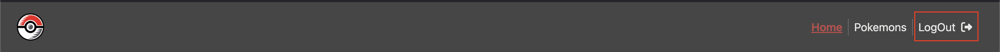

# Router - II

Para poder utilizar las funcionalidades de la página se debe iniciar sesión con las siguientes credenciales:
- username: user
- password: password

de lo contrario, al momento de seleccionar un pokemon, será redireccionado hacia el LogIn (useNavigate).

Puedes ir directamente al LogIn desde la barra de navegación y verás la pestaña destacada en rojo, haciendo referencia a que la dirección url está activa (NavLink).

Una vez que hayas iniciado sesión, serás redireccionado al Home donde debes ver un mensaje de inicio de sesión debajo de la imágen del pokemon.

La barra de navegación también cambiará

Perfecto!! Ahora podrás seleccionar un pokemon desde la barra de dirección `Pokemons` y ver toda su información. 

:octocat: :shipit:
